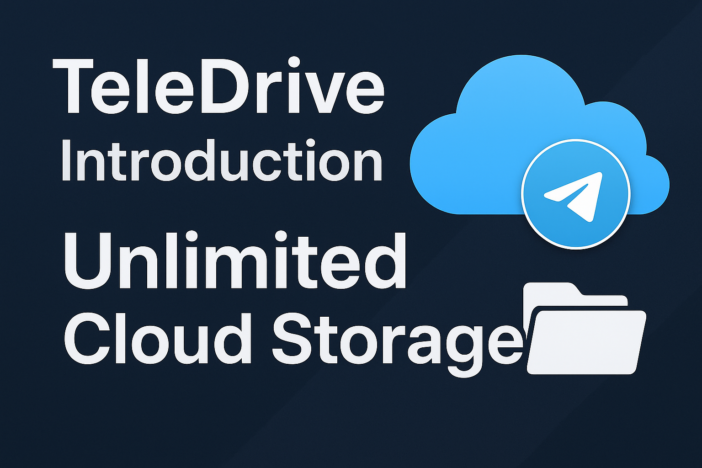

# TeleDrive: Self-Deployable Cloud Storage via Telegram

**Store your files securely and *potentially* unlimitedly using your own Telegram Bot and Channel. Deploy your own private cloud!**

## 🎥 Demo Video
[](https://www.youtube.com/watch?v=QaxEO_LGpXg)

## Project Links

* **GitHub Repository URL:** [GitHub Repo](https://github.com/mohdyaserkt/TeleDrive)
* **Live Demo URL:** [Deployed App](https://yaser768.vercel.app)
* **Demo Video URL:** [Public Video](https://demoyaser768.vercel.app)

## Introduction

Tired of hitting storage limits on popular cloud services like Google Drive (15GB free tier) or Dropbox? Frustrated by the recurring costs of expanding your cloud storage? TeleDrive presents a unique, self-hosted solution leveraging the robust infrastructure of Telegram.

**Problem:** Traditional cloud storage providers offer limited free storage and charge for more space, creating a barrier for users needing larger, personal storage solutions.

**Solution:** TeleDrive allows you to create your *own* private cloud storage system using a Telegram Bot and a private Telegram Channel as the backend storage layer. You deploy the application yourself, connect it to your own Telegram resources, and gain control over your storage space and privacy. While Telegram has its own file size limits (2GB per file for standard bots), TeleDrive includes logic to handle larger files by automatically splitting them into chunks before uploading, effectively allowing storage of files larger than the standard limit.

## Features

*   **Self-Deployable:** Host the application on your own infrastructure (VPS, cloud instance, etc.).
*   **Unlimited Storage (Subject to Telegram):** Storage capacity is effectively limited only by your Telegram account's capacity and the terms of service of Telegram itself, offering a potentially unlimited solution compared to standard free tiers.
*   **Privacy Control:** You control the Telegram Bot and Channel, meaning your data resides in your private space.
*   **Large File Support:** Handles files larger than Telegram's standard 2GB limit by automatically splitting them into manageable chunks during upload and reassembling them during download.
*   **Folder Structure:** Organize your files using a folder system within the application interface.
*   **File Sharing:** Generate public links for specific files to share with others (optional feature, requires careful consideration of privacy).
*   **Dark Theme:** Default shadcn/ui dark theme for a modern look.

## How It Works

1.  **Setup:** You create a private Telegram Channel and a Telegram Bot using `@BotFather`. You configure the application with the Bot Token and Channel ID.
2.  **Upload:** When you upload a file through the web interface:
    *   **Small Files (≤ 2GB):** The file is sent directly to your Telegram Channel via the Bot API. Metadata (filename, Telegram message ID, folder location) is stored in the application's database.
    *   **Large Files (> 2GB):** The file is split into chunks (e.g., 1GB each) in the browser. Each chunk is uploaded sequentially to your Telegram Channel. Metadata for each chunk (filename, chunk index, session ID, Telegram message ID for the chunk, folder location) is stored in the database.
3.  **Storage:** The actual file data resides in your Telegram Channel. The application database stores metadata linking filenames and folder structures to the corresponding Telegram message IDs.
4.  **Download:**
    *   **Small Files:** The application retrieves the Telegram message ID from the database and uses the Telegram API to fetch and serve the file to the user.
    *   **Large Files:** The application retrieves all chunk metadata associated with the original file's session ID. It fetches each chunk sequentially from Telegram and reassembles them before serving the complete file to the user.
5.  **Folder Management:** The application maintains folder structures by associating file metadata with a `parentFolderId` in the database.
6.  **Sharing:** If enabled, the application can generate unique tokens for files, creating public endpoints (`/api/public/[token]`) that allow direct download via the stored Telegram message ID.

## Prerequisites

*   **Node.js:** Version 18 or later.
*   **MongoDB Atlas Account:** A free cluster is sufficient for basic use.
*   **Telegram Account:** Required to create the Bot and Channel.
*   **A Server/Platform:** To deploy the Next.js application (e.g., VPS, Railway, Vercel - ensure it can run Node.js and connect to MongoDB).

## Setup

1.  **Clone the Repository:**
    ```bash
    git clone <your-repository-url>
    cd <your-repository-name>
    ```

2.  **Install Dependencies:**
    ```bash
    npm install
    # or
    yarn install
    ```

3.  **Create Telegram Bot and Channel:**
    *   Open Telegram and search for `@BotFather`.
    *   Start a chat and use `/newbot` to create a new bot. Follow the prompts to get your **Bot Token**.
    *   Create a **Private Telegram Channel** where your files will be stored.
    *   Add your newly created bot to the channel as an administrator, granting it permission to post messages (and potentially delete messages if you implement deletion).

4.  **Configure Environment Variables:**
    *   Copy the `.env.local.example` file to `.env.local`:
        ```bash
        cp .env.local.example .env.local
        ```
    *   Open `.env.local` in a text editor and fill in the required values:
        ```env
        # MongoDB Atlas Connection String (e.g., mongodb+srv://<username>:<password>@cluster0.abc123.mongodb.net/<dbname>?retryWrites=true&w=majority)
        MONGODB_URI=your_mongodb_atlas_connection_string

        # Telegram Bot Token (e.g., 123456789:ABCdefGhIJKlmNoPQRsTUVwxyZ)
        TELEGRAM_BOT_TOKEN=your_telegram_bot_token

        # Telegram Channel ID (e.g., -1001234567890) - You might need to find this via bot commands or inspecting channel info
        TELEGRAM_CHANNEL_ID=your_private_channel_id

        # Admin Credentials for Login Page
        ADMIN_EMAIL=your_admin_email
        ADMIN_PASSWORD=your_admin_password
        ```

5.  **Run the Development Server (Optional for testing):**
    ```bash
    npm run dev
    # or
    yarn dev
    ```
    The application will be available at `http://localhost:3000`.

6.  **Deploy:**
    *   Follow the deployment instructions for your chosen platform (Vercel, Railway, etc.), ensuring your environment variables are correctly set during the deployment process.

## Usage

1.  Navigate to your deployed application URL.
2.  Go to the `/login` page and enter the `ADMIN_EMAIL` and `ADMIN_PASSWORD` configured in your `.env.local`.
3.  You will be redirected to the main storage interface.
4.  Use the "New" button in the sidebar to create folders or upload files.
5.  Click on folders in the sidebar or main content area to navigate and organize your files.
6.  Upload files using the "Upload File" button in the sidebar or by clicking the "New" button.
7.  Manage existing files using the action buttons (Download, Share).

## Important Considerations (Disclaimer)

*   **Telegram Terms of Service:** Using Telegram Bot API primarily for file storage might violate Telegram's Terms of Service. Use this application responsibly and be aware of potential risks (e.g., bot/channel suspension).
*   **Reliability:** The application relies on the Telegram Bot API and the availability of Telegram's servers. Performance and uptime depend on Telegram's infrastructure.
*   **Security:** The application stores credentials (Bot Token, Channel ID) in environment variables, which is standard practice. Ensure your deployment environment is secure. The login page provides basic access control, but consider implementing stronger authentication for production use.
*   **Chunking:** File chunking for large files is implemented but adds complexity and potential points of failure during upload/download.
*   **Privacy:** While the channel is private, files are stored on Telegram's servers. Consider the privacy implications of storing sensitive data this way.


## Contributing

Feel free to fork the repository, create pull requests, or raise issues for bugs and feature suggestions.

## License

[Specify your license, e.g., MIT, Apache 2.0, etc.]